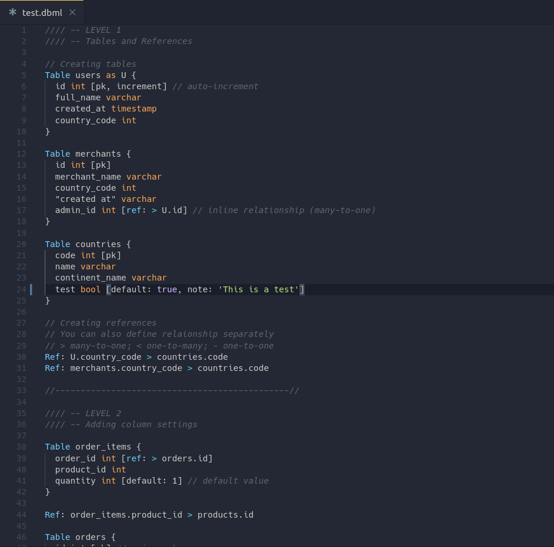

# DBML Language Support

[![Version 0.1.0 Badge][version-badge]][changelog] [![MIT License Badge][license-badge]][license]

This Visual Studio Code extension provides language support for the Database Markup Language ([DBML](https://dbml.org)).

## Installation

This extension is not currently on the VS Code Marketplace. In order to install, clone or download the repository and place it in the VS Code extension directory. By default this directory is located at

- Linux: `~/.vscode/extensions`
- macOS: `~/.vscode/extensions`
- Windows: `%USERPROFILE%\.vscode\extensions`

Upon placing the extension in the extensions directory, it will be automatically enabled.

## Syntax Highlighting

Syntax highlighting is enabled for files with the `.dbml` extension.

## Snippets

Snippets are provided for quickly creating tables, enums, and references. To use a snippet, begin typing any of the following keys.

- `table`: Create a new table with an int id as the primary key
- `enum`: Create a new enum
- `oto`: Create a one-to-one reference
- `otm`: Create a one-to-many reference
- `mto`: Create a many-to-one reference
- `mtm`: Create a many-to-many join table

## Issues

If you find an error or bug, please [create an issue](https://github.com/mattmeyers/vscode-dbml/issues/new).

[changelog]: ./CHANGELOG.md
[license]: ./LICENSE
[version-badge]: https://img.shields.io/badge/version-0.1.0-blue.svg
[license-badge]: https://img.shields.io/badge/license-MIT-blue.svg
